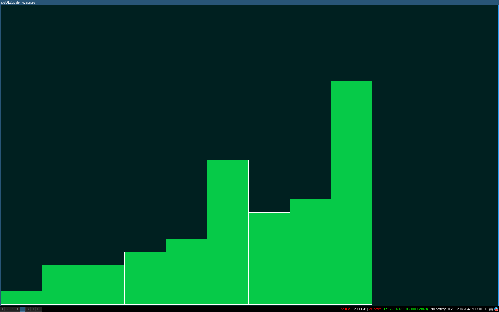

# Simple Data Visualization

Providing a simple C++ API to visualize datas.

## Pros

- Single header
- Easy to use
- fit with all STL containers(custom containers need to have ForwardIterator)

## Example Preview

## Dependencies

- SDL2
- [SDL2pp](https://github.com/libSDL2pp/libSDL2pp)
